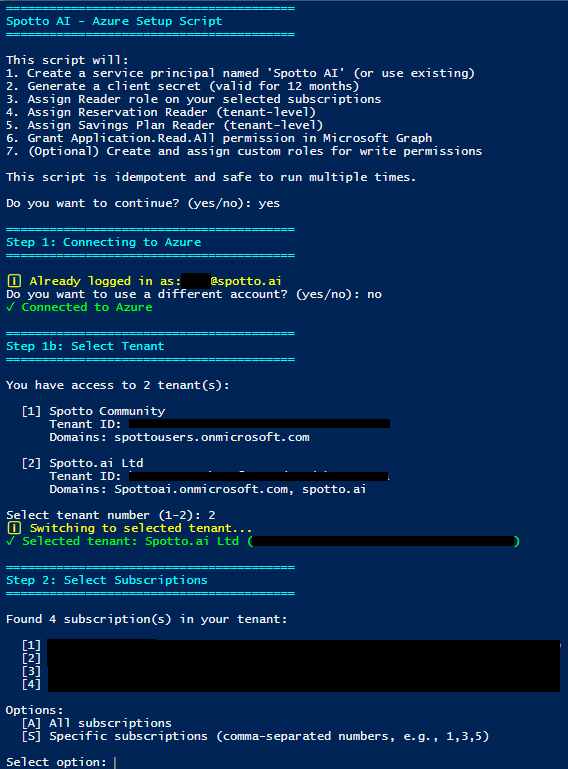

# Spotto AI - Azure Onboarding Script

This directory contains the `Setup-SpottoAzure.ps1` PowerShell script, which automates the process of connecting your Azure environment to Spotto AI.

## Overview

The script performs the following actions:
1.  Creates an Azure AD Application and Service Principal for Spotto.
2.  Assigns the **Reader** role to selected subscriptions (or all of them).
3.  Assigns **Reservations Reader** and **Savings Plan Reader** roles at the tenant level.
4.  Grants **Application.Read.All** permission in Microsoft Graph (to monitor credential expiry).
5.  (Optional) Creates and assigns a custom role for **write permissions** (Advisor recommendations, Storage inventory).
6.  Outputs the credentials needed to configure Spotto.

## Prerequisites

Before running the script, ensure you have:

*   **PowerShell 5.1** or **PowerShell 7+**
*   **Azure Account Permissions**:
    *   **Global Administrator** or **Application Administrator** (to create the Service Principal).
    *   **Owner** or **User Access Administrator** on the subscriptions you want to onboard (to assign roles).
*   **PowerShell Modules** (the script will attempt to install these if missing):
    *   `Az.Accounts`
    *   `Az.Resources`
    *   `Microsoft.Graph.Authentication`
    *   `Microsoft.Graph.Applications`
*   **Multi-tenant / MFA**: If your account has access to multiple tenants or is protected by conditional access (MFA), you may be prompted to sign in more than once.

## Required Permissions by Scope

*   **App registration**: Global Administrator or Application Administrator.
*   **Subscription role assignments**: Owner or User Access Administrator on each subscription.
*   **Management Groups**: Management Group Contributor or Owner at the root management group.
*   **Reservations / Savings Plans**: Tenant-level permissions to assign roles at `/providers/Microsoft.Capacity` and `/providers/Microsoft.BillingBenefits`.

## Usage

1.  Open a PowerShell terminal.
2.  Navigate to this directory:
    ```powershell
    cd onboarding/azure
    ```
3.  Run the script:
    ```powershell
    .\Setup-SpottoAzure.ps1
    ```

## What it looks like

The onboarding script runs as a simple PowerShell wizard:



## Interactive Steps

The script is interactive and will guide you through the process:

1.  **Azure Login**: It will prompt you to log in to Azure if not already connected.
2.  **Tenant Selection**: If you have access to multiple tenants, you will be asked to select one.
3.  **Subscription Selection**: You can choose to onboard **All** subscriptions or select specific ones by index.
4.  **Service Principal**: It checks for an existing "Spotto AI" app. If not found, it creates one.
5.  **Client Secret**: It generates a new client secret (valid for 1 year) or asks to use an existing one if available.
6.  **Optional Write Permissions**: You will be asked if you want to grant optional write permissions for:
    *   Dismissing Azure Advisor recommendations.
    *   Enabling Storage Inventory reports.

## Output

Upon successful completion, the script will display the credentials you need to enter in the Spotto Portal:

*   **Application (Client) ID**
*   **Directory (Tenant) ID**
*   **Client Secret**
*   **Secret Expiry Date**

> **⚠️ Important:** The Client Secret is shown only once. Make sure to copy it immediately.

## Troubleshooting

*   **Execution Policy Error**: If you receive an error stating *"cannot be loaded because running scripts is disabled on this system"*, you need to update your PowerShell execution policy. Run the following command in your PowerShell terminal before executing the script:
    ```powershell
    Set-ExecutionPolicy -Scope Process -ExecutionPolicy Bypass
    ```
    This allows scripts to run for the current PowerShell session only. The policy resets to its default when you close the terminal window.
*   **Permission Errors**: If you see errors regarding role assignments, ensure your user account has `Owner` or `User Access Administrator` rights on the target subscriptions.
*   **"Please provide a valid tenant or a valid subscription"**: Re-authenticate for the tenant shown in the warning:
    ```powershell
    Connect-AzAccount -TenantId <tenantId>
    ```
    Then re-run the script and select the affected subscriptions.
*   **"Forbidden" role assignment errors**: Your account lacks permission at that scope (subscription, management group, or tenant-level billing scopes). Ask a tenant admin or subscription owner to run the script or assign the roles manually.
*   **"Conflict" during custom role creation**: The custom role already exists in the tenant. This is safe to ignore; re-run the script if you need to assign it to more subscriptions.
*   **Module Errors**: If module installation fails, try running PowerShell as Administrator or install them manually:
    ```powershell
    Install-Module -Name Az -Scope CurrentUser -Force
    Install-Module -Name Microsoft.Graph -Scope CurrentUser -Force
    ```

## Security Note

The script is designed to be **idempotent**. You can run it multiple times safely to update permissions or rotate secrets without creating duplicate service principals.
