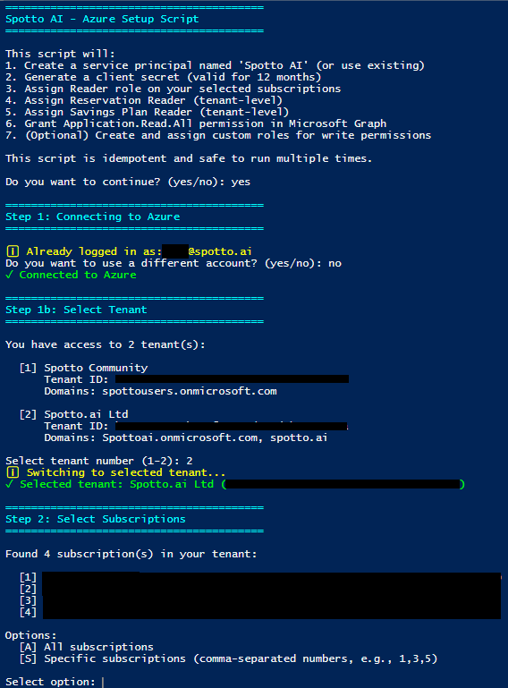

# Spotto AI - Azure Onboarding Script

This directory contains the `Setup-SpottoAzure.ps1` PowerShell script, which automates the process of connecting your Azure environment to Spotto AI.

## Overview

The script performs the following actions:
1.  Creates an Azure AD Application and Service Principal for Spotto.
2.  Assigns **Reader** access based on your selection:
    *   **All subscriptions**: assigns **Reader** once at tenant root scope (`/`) so it inherits to all current and future subscriptions.
    *   **Specific subscriptions**: assigns **Reader** on each selected subscription.
3.  (Optional, recommended) Assigns **Monitoring Reader** and **Log Analytics Reader**.
    *   **Monitoring Reader** adds access needed for Application Insights queries via `Microsoft.Insights/Components/Query/Read`.
    *   **Log Analytics Reader** is assigned at the **root management group** when you choose **All subscriptions** for tenant-wide workspace log access, otherwise on the selected subscriptions.
    *   **Log Analytics Reader** is broader than **Log Analytics Data Reader** and supports current plus future Log Analytics workspace analysis scenarios.
4.  Assigns **Reader** and **Management Group Reader** at the root management group for tenant governance hierarchy plus management-group policy and RBAC metadata.
5.  Assigns **Reservations Reader** at `/providers/Microsoft.Capacity` and **Savings plan Reader** at `/providers/Microsoft.BillingBenefits`.
6.  Grants **Application.Read.All** in Microsoft Graph with admin consent so Spotto can read applications and service principals for governance and credential posture.
7.  (Optional) Creates and assigns a custom role for **write permissions** (Advisor recommendations, Storage inventory).
8.  Outputs the credentials needed to configure Spotto.

## Prerequisites

Before running the script, ensure you have:

*   **PowerShell 5.1** or **PowerShell 7+**
*   **Azure Account Permissions**:
    *   **Global Administrator** or **Application Administrator** (to create the Service Principal).
    *   **Owner** or **User Access Administrator** on the subscriptions you want to onboard, or at tenant root scope (`/`) if you choose **All subscriptions**.
    *   If you choose **All subscriptions** and want the script to assign **Reader** at tenant root scope (`/`), a **Global Administrator** typically needs to enable **Microsoft Entra ID** > **Properties** > **Access management for Azure resources**, then sign out and sign back in before running the script.
    *   A tenant admin able to grant **Microsoft Graph Application.Read.All** admin consent.
*   **PowerShell Modules** (the script will attempt to install these if missing):
    *   `Az.Accounts`
    *   `Az.Resources`
    *   `Microsoft.Graph.Authentication`
    *   `Microsoft.Graph.Applications`
*   **Multi-tenant / MFA**: If your account has access to multiple tenants or is protected by conditional access (MFA), you may be prompted to sign in more than once.

## Required Permissions by Scope

*   **App registration**: Global Administrator or Application Administrator.
*   **Subscription Reader assignments**: Owner or User Access Administrator on each selected subscription.
*   **Tenant root Reader assignment for All subscriptions**: Owner or User Access Administrator at root scope (`/`). Global Administrators usually get this by enabling **Access management for Azure resources** in Microsoft Entra ID.
*   **Reader at the root management group**: Management Group Contributor or Owner at the root management group.
*   **Management Group Reader at the root management group**: Management Group Contributor or Owner at the root management group.
*   **Log Analytics Reader at the root management group for All subscriptions**: Management Group Contributor or Owner at the root management group.
*   **Log Analytics Reader on selected subscriptions**: Owner or User Access Administrator on each selected subscription if you are not using tenant-wide onboarding.
*   **Reservations Reader**: Permission to assign the role at `/providers/Microsoft.Capacity`.
*   **Savings plan Reader**: Permission to assign the role at `/providers/Microsoft.BillingBenefits`.
*   **Microsoft Graph Application.Read.All**: Tenant admin consent for the application permission so Spotto can read applications and service principals for governance and credential posture.

## Usage

1.  Open a PowerShell terminal.
2.  Navigate to this directory:
    ```powershell
    cd onboarding/azure
    ```
3.  Run the script:
    ```powershell
    .\Setup-SpottoAzure.ps1
    ```

## What it looks like

The onboarding script runs as a simple PowerShell wizard:



## Interactive Steps

The script is interactive and will guide you through the process:

1.  **Azure Login**: It will prompt you to log in to Azure if not already connected.
2.  **Tenant Selection**: If you have access to multiple tenants, you will be asked to select one.
3.  **Subscription Selection**: You can choose to onboard **All** subscriptions or select specific ones by index.
    *   If you choose **All**, the script assigns **Reader** at tenant root scope (`/`) instead of creating one assignment per subscription.
    *   If you choose **Specific**, the script assigns **Reader** only on the subscriptions you selected.
4.  **Service Principal**: It checks for an existing "Spotto AI" app. If not found, it creates one.
5.  **Client Secret**: It generates a new client secret (valid for 1 year) or asks to use an existing one if available.
6.  **Optional Recommended Monitoring Roles**: You will be asked if you want to grant these optional recommended roles using a `yes` or `no` prompt. Press **Enter** to accept the default of **yes**.
    *   **Monitoring Reader** on selected subscriptions.
        Adds `Microsoft.Insights/Components/Query/Read` for Application Insights queries.
    *   **Log Analytics Reader**.
        For **All subscriptions**, the script assigns this once at the root management group for tenant-wide workspace log access.
        For **Specific subscriptions**, the script assigns it on each selected subscription.
        This broader role supports current query needs plus future Log Analytics optimization analysis.
7.  **Governance + Billing Reader Roles**: The script assigns:
    *   **Reader** at the root management group for tenant governance hierarchy access.
    *   **Management Group Reader** at the root management group for hierarchy plus policy/RBAC metadata.
    *   **Reservations Reader** at `/providers/Microsoft.Capacity`.
    *   **Savings plan Reader** at `/providers/Microsoft.BillingBenefits`.
8.  **Microsoft Graph Governance Permission**: The script grants **Application.Read.All** with admin consent so Spotto can read applications and service principals for governance and credential posture.
9.  **Optional Write Permissions**: You will be asked if you want to grant optional write permissions for:
    *   Dismissing Azure Advisor recommendations.
    *   Enabling Storage Inventory reports.

## Output

Upon successful completion, the script will display the credentials you need to enter in the Spotto Portal:

*   **Application (Client) ID**
*   **Directory (Tenant) ID**
*   **Client Secret**
*   **Secret Expiry Date**

> **⚠️ Important:** The Client Secret is shown only once. Make sure to copy it immediately.

> **Note:** Azure RBAC changes and Microsoft Graph admin consent can take 5-15 minutes to propagate after the script completes. During that window, Spotto may validate the credentials successfully while tenant-level governance data such as management group hierarchy, policy/RBAC context, or service principal posture still shows access denied.

## Troubleshooting

*   **Execution Policy Error**: If you receive an error stating *"cannot be loaded because running scripts is disabled on this system"*, you need to update your PowerShell execution policy. Run the following command in your PowerShell terminal before executing the script:
    ```powershell
    Set-ExecutionPolicy -Scope Process -ExecutionPolicy Bypass
    ```
    This allows scripts to run for the current PowerShell session only. The policy resets to its default when you close the terminal window.
*   **Permission Errors**: If you see errors regarding role assignments, ensure your user account has `Owner` or `User Access Administrator` rights on the target subscriptions. If you selected **All subscriptions**, ensure you also have that access at tenant root scope (`/`). The management group and billing-scope role assignments also need rights at those scopes.
*   **Root scope Reader assignment failed**: If the script says it could not assign **Reader** at tenant root scope (`/`), and you are a Global Administrator, enable **Microsoft Entra ID** > **Properties** > **Access management for Azure resources**, sign out, sign back in, and rerun the script. If you cannot get root-scope access, rerun the script and choose specific subscriptions instead.
*   **"Please provide a valid tenant or a valid subscription"**: Re-authenticate for the tenant shown in the warning:
    ```powershell
    Connect-AzAccount -TenantId <tenantId>
    ```
    Then re-run the script and select the affected subscriptions.
*   **Root management group Reader or Management Group Reader failed**: Confirm management groups are enabled and that you have `Management Group Contributor` or `Owner` at the root management group. If not, assign the missing role manually in **Azure Portal > Management Groups**.
*   **Tenant governance shows "access denied" after onboarding**: Wait 5-15 minutes and retry first, because tenant-scope RBAC and Microsoft Graph consent can lag behind the script output. If the error remains, confirm both **Reader** and **Management Group Reader** are assigned at the root management group, confirm Microsoft Graph **Application.Read.All** shows admin consent granted, and confirm the service principal received the intended tenant/root-scope access rather than subscription-only assignments.
*   **Log Analytics Reader failed**: Confirm you have permission to assign roles at the root management group for tenant-wide onboarding, or at each selected subscription for per-subscription onboarding. If needed, assign **Log Analytics Reader** manually and rerun the script.
*   **Reservations Reader / Savings plan Reader failed**: Your account lacks permission at the billing provider scopes `/providers/Microsoft.Capacity` or `/providers/Microsoft.BillingBenefits`. Ask a tenant admin to assign these roles manually if needed.
*   **Microsoft Graph Application.Read.All failed**: The tenant still needs admin consent for the Microsoft Graph application permission. Have a tenant admin grant **Application.Read.All** with admin consent in **Azure Portal > App Registrations > API permissions**, then rerun the script.
*   **"Forbidden" role assignment errors**: Your account lacks permission at that scope (subscription, root management group, or tenant billing scopes). Ask a tenant admin or subscription owner to run the script or assign the roles manually.
*   **"Conflict" during custom role creation**: The custom role already exists in the tenant. This is safe to ignore; re-run the script if you need to assign it to more subscriptions.
*   **Module Errors**: If module installation fails, try running PowerShell as Administrator or install them manually:
    ```powershell
    Install-Module -Name Az -Scope CurrentUser -Force
    Install-Module -Name Microsoft.Graph -Scope CurrentUser -Force
    ```

## Security Note

The script is designed to be **idempotent**. You can run it multiple times safely to update permissions or rotate secrets without creating duplicate service principals.
