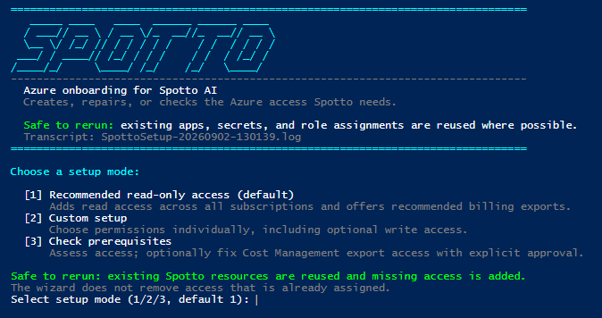

# Spotto AI - Azure Onboarding Script

This directory contains the `Setup-SpottoAzure.ps1` PowerShell script, which automates the process of connecting your Azure environment to Spotto AI.

## Overview

The script performs the following actions:
1.  Creates an Azure AD Application and Service Principal for Spotto.
2.  Creates or reuses a client secret and immediately shows a **Spotto registration checkpoint** so you can add/update the cloud account in Spotto before the remaining Azure role and export steps run.
3.  Assigns **Reader** access based on your selection:
    *   **All subscriptions**: assigns **Reader** once at tenant root scope (`/`) so it inherits to all current and future subscriptions.
    *   **Specific subscriptions**: assigns **Reader** on each selected subscription.
4.  (Optional, recommended) Assigns **Monitoring Reader** and **Log Analytics Reader**.
    *   **Monitoring Reader** adds access needed for Application Insights queries via `Microsoft.Insights/Components/Query/Read`.
    *   **Log Analytics Reader** is assigned at the **root management group** when you choose **All subscriptions** for tenant-wide workspace log access, otherwise on the selected subscriptions.
    *   **Log Analytics Reader** is broader than **Log Analytics Data Reader** and supports current plus future Log Analytics workspace analysis scenarios.
5.  Assigns **Reader** and **Management Group Reader** at the root management group for tenant governance hierarchy plus management-group policy and RBAC metadata.
6.  Assigns **Reservations Reader** at `/providers/Microsoft.Capacity` and asks by default for **Reservations Contributor** at the same scope so Spotto can calculate reservation refund quotes and support reservation management workflows.
7.  Assigns **Savings plan Reader** at `/providers/Microsoft.BillingBenefits`.
8.  Optionally grants Microsoft Graph application permissions with admin consent so Spotto can read applications, service principals, directory roles, Global Admin/PIM schedules, group membership, users, and audit logs for governance visibility.
9.  (Highly recommended) Configures **Cost Management exports** to customer-owned Azure Storage. This can be skipped and rerun later; the service principal credentials are shown before this step so export delays do not block basic cloud account registration:
    *   Detects compatible existing billing-scope exports when you select or paste an EA/MCA billing scope, then can grant the Spotto service principal **Storage Blob Data Reader** on their containers without changing the billing-scope export storage account networking.
    *   Warns when reused billing-scope export storage appears unreachable through its public network endpoint. **Storage Blob Data Reader** grants identity access only; it does not bypass a disabled public endpoint or storage firewall.
    *   Detects compatible existing daily actual/amortized exports and can grant the Spotto service principal **Storage Blob Data Reader** on their containers.
    *   Creates a new or selected existing storage account/container when no suitable export destination is available.
    *   Creates daily CSV/GZIP exports and queues one-time exports for the previous 13 closed months where the subscription supports the dataset.
    *   Continues with per-subscription exports as a fallback unless you explicitly confirm the billing-scope export covers all selected subscriptions and datasets.
    *   Skips export setup with a friendly warning when Cost Management exports are unavailable for a subscription offer, billing scope, or dataset.
10.  (Optional) Creates and assigns a custom role for **write permissions** (Advisor recommendations, Storage inventory).
11.  (Separately optional) Creates a least-privilege **Azure Policy exemption** role on selected subscriptions and, only after a second confirmation, an action-only role at selected management-group assignment scopes.
12. Outputs the credentials needed to configure Spotto again at completion.

You can safely rerun the script if validation needs more time, permissions change, or you need to retry a failed step. It checks for existing Spotto resources, role assignments, storage containers, and export definitions, then reuses or updates them where possible.

## Prerequisites

Before running the script, ensure you have:

*   **PowerShell 5.1** or **PowerShell 7+**
*   **Azure Account Permissions**:
    *   **Global Administrator** or **Application Administrator** (to create the Service Principal).
    *   A role with `Microsoft.Authorization/roleAssignments/write`, such as **Owner**, **User Access Administrator**, or **Role Based Access Control Administrator**, on the subscriptions you want to onboard, or at tenant root scope (`/`) if you choose **All subscriptions**.
    *   If you choose **All subscriptions** and want the script to assign **Reader** at tenant root scope (`/`), a **Global Administrator** typically needs to enable **Microsoft Entra ID** > **Properties** > **Access management for Azure resources**, then sign out and sign back in before running the script.
    *   A tenant admin able to grant Microsoft Graph governance permissions with admin consent, if you choose to grant Graph governance permissions.
    *   Highly recommended billing export setup requires rights to manage Cost Management exports, storage accounts, blob containers, and `Storage Blob Data Reader` role assignments.
    *   If reusing an export created at billing scope, the Spotto service principal also needs reader access at that billing scope. For MCA scopes, assign the relevant Billing account/profile/invoice section reader role. For EA scopes, assign the equivalent EA read role such as enrollment or department reader using Azure Billing role assignments.
    *   If reusing billing-scope export storage, the storage account must also be reachable by Spotto cloud-engine. Keep anonymous blob access disabled, but public network access must be enabled and the firewall must allow access unless you have a supported private connectivity path.
*   **Privileged Identity Management (PIM)**:
    *   Activate the Microsoft Entra role used for app registration work, such as Application Administrator, before starting the script.
    *   Activate Privileged Role Administrator or Global Administrator before the Graph consent step if you want Spotto to see Global Admin/PIM role schedules and audit context.
    *   Activate the Azure RBAC role used for role assignments, such as Owner, User Access Administrator, or Role Based Access Control Administrator at the selected subscription/root scope, before starting the script.
    *   If you activate PIM after signing in, reconnect with `Disconnect-AzAccount` then `Connect-AzAccount -TenantId <tenantId>` so the PowerShell session receives fresh permissions.
    *   Make sure the activation window is long enough for the selected role and export steps. The script is idempotent, so it can be rerun after reactivating PIM.
*   **PowerShell Modules** (the script will attempt to install these if missing):
    *   `Az.Accounts`
    *   `Az.Resources`
    *   `Az.Storage`
    *   `Microsoft.Graph.Authentication` if you choose to grant Graph governance permissions
    *   `Microsoft.Graph.Applications` if you choose to grant Graph governance permissions
*   **Multi-tenant / MFA**: If your account has access to multiple tenants or is protected by conditional access (MFA), you may be prompted to sign in more than once.

## Required Permissions by Scope

*   **App registration**: Global Administrator or Application Administrator.
*   **Subscription Reader assignments**: `Microsoft.Authorization/roleAssignments/write` on each selected subscription, such as Owner, User Access Administrator, or Role Based Access Control Administrator.
*   **Tenant root Reader assignment for All subscriptions**: `Microsoft.Authorization/roleAssignments/write` at root scope (`/`). Global Administrators usually get this by enabling **Access management for Azure resources** in Microsoft Entra ID.
*   **Reader, Management Group Reader, and Log Analytics Reader at the root management group**: `Microsoft.Authorization/roleAssignments/write` at that management group, such as Owner, User Access Administrator, or Role Based Access Control Administrator. Management Group Contributor alone cannot assign Azure RBAC access.
*   **Log Analytics Reader on selected subscriptions**: `Microsoft.Authorization/roleAssignments/write` on each selected subscription if you are not using tenant-wide onboarding.
*   **Reservations Reader**: Permission to assign the role at `/providers/Microsoft.Capacity`.
*   **Reservations Contributor**: Recommended permission to assign the role at `/providers/Microsoft.Capacity` so Spotto can calculate reservation refund quotes and support reservation management workflows. The script defaults to assigning it, but if this is skipped or fails, onboarding continues with read-only reservation access.
*   **Savings plan Reader**: Permission to assign the role at `/providers/Microsoft.BillingBenefits`.
*   **Microsoft Graph governance permissions**: Optional tenant admin consent for the application permissions Spotto uses for Global Admin/PIM, audit, directory, and credential posture visibility:
    *   `Application.Read.All`
    *   `RoleAssignmentSchedule.Read.Directory`
    *   `RoleEligibilitySchedule.Read.Directory`
    *   `RoleManagement.Read.Directory`
    *   `GroupMember.Read.All`
    *   `User.Read.All`
    *   `AuditLog.Read.All`
*   **Cost Management exports**: Permission to create/update `Microsoft.CostManagement/exports` on selected subscriptions.
    *   Cost Management export availability depends on the Azure agreement, subscription offer, billing scope, and dataset. Some subscription offers, newly created subscriptions, or amortized datasets might not be available.
*   **Existing billing-scope Cost Management exports**: Permission for the signed-in operator to list exports at the billing scope during setup, plus reader access for the Spotto service principal at the same billing scope so Spotto can discover the export later.
    *   `Cost Management Reader` is the read-only role for Azure RBAC cost scopes. EA/MCA billing hierarchy scopes need their billing reader role at the exact billing scope.
    *   MCA billing scopes use billing roles such as Billing account reader, Billing profile reader, or Invoice section reader.
    *   EA billing scopes use EA billing hierarchy roles such as enrollment or department reader via Azure Billing role assignments.
*   **Billing export storage**: Permission to create or update the selected storage account and container, plus Owner or User Access Administrator permission to assign **Storage Blob Data Reader** at the container scope.
    *   Spotto authenticates with the service principal, so anonymous blob access should stay disabled.
    *   The storage account still needs a reachable public network endpoint. If public network access is disabled or the firewall blocks Spotto, RBAC permissions are not enough for Spotto cloud-engine to read the export.
*   **Policy exemption target**: `Microsoft.Authorization/roleDefinitions/write` and `Microsoft.Authorization/roleAssignments/write` on each selected subscription. Owner or User Access Administrator provides both; Role Based Access Control Administrator alone cannot create the custom role definition. The role assigned to Spotto contains `Microsoft.Authorization/policyExemptions/write` and `Microsoft.Authorization/policyAssignments/exempt/action` only.
*   **Inherited policy assignment**: the same role-definition and role-assignment write permissions at every management group you explicitly select. Azure permits only one management group in each custom role's assignable scopes; every generated role contains `Microsoft.Authorization/policyAssignments/exempt/action` only.

## Usage

1.  Open a PowerShell terminal.
2.  Navigate to this directory:
    ```powershell
    cd onboarding/azure
    ```
3.  Run the script:
    ```powershell
    .\Setup-SpottoAzure.ps1
    ```

## What it looks like

The onboarding script runs as a simple PowerShell wizard:



## Interactive Steps

The script is interactive and will guide you through the process:

1.  **Azure Login**: It will prompt you to log in to Azure if not already connected.
2.  **Tenant Selection**: If you have access to multiple tenants, you will be asked to select one.
3.  **Subscription Selection**: You can choose to onboard **All** subscriptions or select specific ones by index. Index selectors accept comma-separated numbers and ranges (for example `1,3,5-9`), plus `all` where selecting everything is safe.
    *   If you choose **All**, the script assigns **Reader** at tenant root scope (`/`) instead of creating one assignment per subscription.
    *   If you choose **Specific**, the script assigns **Reader** only on the subscriptions you selected.
4.  **Service Principal**: It checks for an existing "Spotto" app first, then "Spotto AI" for compatibility. If neither exists, it creates a new "Spotto" app.
5.  **Client Secret**: It generates a new client secret (valid for 1 year) or asks to use an existing one if available.
6.  **Spotto Registration Checkpoint**: After the service principal credential exists, the script shows the Application ID, Tenant ID, client secret/secret note, and Spotto Portal next steps. Add or update the Spotto cloud account at this point if you want a recoverable checkpoint before RBAC or export work continues.
7.  **Optional Recommended Monitoring Roles**: You will be asked if you want to grant these optional recommended roles using a `yes` or `no` prompt. Press **Enter** to accept the default of **yes**.
    *   **Monitoring Reader** on selected subscriptions.
        Adds `Microsoft.Insights/Components/Query/Read` for Application Insights queries.
    *   **Log Analytics Reader**.
        For **All subscriptions**, the script assigns this once at the root management group for tenant-wide workspace log access.
        For **Specific subscriptions**, the script assigns it on each selected subscription.
        This broader role supports current query needs plus future Log Analytics optimization analysis.
8.  **Governance + Billing Reader Roles**: The script assigns:
    *   **Reader** at the root management group for tenant governance hierarchy access.
    *   **Management Group Reader** at the root management group for hierarchy plus policy/RBAC metadata.
    *   **Reservations Reader** at `/providers/Microsoft.Capacity`.
    *   Asks for **Reservations Contributor** at `/providers/Microsoft.Capacity` with a default of **yes**.
        This enables reservation refund quote calculation and future reservation management workflows. If you answer **no** or the assignment fails, onboarding continues with read-only reservation access.
    *   **Savings plan Reader** at `/providers/Microsoft.BillingBenefits`.
9.  **Microsoft Graph Governance Permissions**: You will be asked if you want the script to connect to Microsoft Graph and grant the required application permissions with admin consent. These cover application posture, Global Admin/PIM role schedules, role management, group membership, user profile data, and audit logs. If you answer **no**, the script skips Microsoft Graph and continues with the remaining onboarding steps.
10. **Highly Recommended Cost Management Exports**: You will be asked if you want to configure exports. The default is **yes** because exports reduce Cost Management API calls and Azure rate limiting.
    *   Before touching any subscription, the script validates that your account holds `Microsoft.CostManagement/exports/write` on each selected subscription. User Access Administrator alone does not grant this.
    *   Where that permission is missing but your account can assign roles at that subscription (for example via User Access Administrator at tenant root or a break-glass elevation), the script offers to assign **Cost Management Contributor** to your own account, waits for RBAC propagation, and reminds you at the end to remove the temporary role after onboarding.
    *   Where the permission is missing and self-elevation is not possible, that subscription is skipped for export setup with guidance, and onboarding continues.
    *   Export creation and backfill run requests that hit Cost Management rate limiting (`429 Too Many Requests`) are retried automatically, honouring the retry-after hint in the error.
    *   The script can check billing scopes that your signed-in account can access, or you can paste a billing scope resource ID such as `/providers/Microsoft.Billing/billingAccounts/...`.
    *   The billing scope selector accepts `all`, comma-separated numbers, and ranges (for example `1,3,5-9`), so large scope lists do not require typing every index.
    *   If a compatible billing-scope export is accepted, the script prepares Spotto blob read access and asks whether to skip subscription-level exports. The default is to keep the per-subscription fallback.
    *   For billing-scope export storage, the script warns about public endpoint/firewall settings but does not change them automatically.
    *   The script displays the billing scope and Spotto service principal object ID so a billing admin can assign the required billing-scope reader role if it is not already present.
    *   If compatible daily exports already exist, the script can reuse them and grant Spotto blob read access to their containers.
    *   If no suitable destination exists, the script can create a storage account or use an existing one.
    *   New billing export resource groups and storage accounts default to Azure location `australiaeast` (Australia East).
    *   The script keeps anonymous blob access disabled, containers private, and the storage public endpoint enabled so Spotto cloud-engine can authenticate and read the data later.
    *   The script creates actual-cost exports and attempts amortized-cost exports. Amortized exports are skipped where Azure does not support them.
    *   Newly created daily recurring exports are run immediately when Azure accepts the run request, so Spotto does not have to wait for the first scheduled daily run.
    *   Historical backfill exports are marked after they are queued, so rerunning the script can recover interrupted backfills without repeated queueing.
11. **Optional Write Permissions**: You will be asked if you want to grant optional write permissions for:
    *   Dismissing Azure Advisor recommendations.
    *   Enabling Storage Inventory reports.
12. **Azure Policy Exemptions (Separate Consent)**: You will be asked independently whether Spotto may create scoped policy exemptions on the selected subscriptions.
    *   Direct subscription assignments need only the subscription role.
    *   Inherited initiatives also need the assignment action at the management group that owns the assignment.
    *   The management-group selector defaults to none and displays the exact scopes and action before a final confirmation.
    *   Answering no leaves regulatory compliance read-only and does not change Advisor/Storage permissions.

## Output

Upon successful completion, the script will display the credentials you need to enter in the Spotto Portal:

*   **Application (Client) ID**
*   **Directory (Tenant) ID**
*   **Client Secret**
*   **Secret Expiry Date**

> **⚠️ Important:** The Client Secret is shown only once. Make sure to copy it immediately.

> **Note:** Azure RBAC changes and Microsoft Graph admin consent, if granted, can take 5-15 minutes to propagate after the script completes. During that window, Spotto may validate the credentials successfully while tenant-level governance data such as management group hierarchy, policy/RBAC context, Global Admin/PIM schedules, audit logs, group membership, users, or service principal posture still shows access denied.

## Troubleshooting

*   **Execution Policy Error**: If you receive an error stating *"cannot be loaded because running scripts is disabled on this system"*, you need to update your PowerShell execution policy. Run the following command in your PowerShell terminal before executing the script:
    ```powershell
    Set-ExecutionPolicy -Scope Process -ExecutionPolicy Bypass
    ```
    This allows scripts to run for the current PowerShell session only. The policy resets to its default when you close the terminal window.
*   **Permission Errors**: If you see errors regarding role assignments, ensure your user account has `Microsoft.Authorization/roleAssignments/write`, such as through Owner, User Access Administrator, or Role Based Access Control Administrator, on the target subscriptions. If you selected **All subscriptions**, ensure you also have that access at tenant root scope (`/`). The management group and billing-scope role assignments also need rights at those scopes.
*   **PIM activated but the script still gets Forbidden**: Reconnect after activation with `Disconnect-AzAccount` and `Connect-AzAccount -TenantId <tenantId>`, then rerun the script. Azure RBAC changes can take several minutes to become visible to all Azure Resource Manager calls.
*   **Root scope Reader assignment failed**: If the script says it could not assign **Reader** at tenant root scope (`/`), and you are a Global Administrator, enable **Microsoft Entra ID** > **Properties** > **Access management for Azure resources**, sign out, sign back in, and rerun the script. If you cannot get root-scope access, rerun the script and choose specific subscriptions instead.
*   **"Please provide a valid tenant or a valid subscription"**: Re-authenticate for the tenant shown in the warning:
    ```powershell
    Connect-AzAccount -TenantId <tenantId>
    ```
    Then re-run the script and select the affected subscriptions.
*   **Root management group Reader or Management Group Reader failed**: Confirm management groups are enabled and that you have `Microsoft.Authorization/roleAssignments/write` at the root management group. Owner, User Access Administrator, or Role Based Access Control Administrator can provide it; Management Group Contributor alone cannot assign access. If needed, assign the missing role manually in **Azure Portal > Management Groups**.
*   **Tenant governance, Global Admin/PIM, or audit data shows "access denied" after onboarding**: Wait 5-15 minutes and retry first, because tenant-scope RBAC and Microsoft Graph consent can lag behind the script output. If the error remains, confirm both **Reader** and **Management Group Reader** are assigned at the root management group, confirm all Microsoft Graph governance permissions show admin consent granted if you chose the Graph step, and confirm the service principal received the intended tenant/root-scope access rather than subscription-only assignments.
*   **Log Analytics Reader failed**: Confirm you have permission to assign roles at the root management group for tenant-wide onboarding, or at each selected subscription for per-subscription onboarding. If needed, assign **Log Analytics Reader** manually and rerun the script.
*   **Reservations Reader / Savings plan Reader failed**: Your account lacks permission at the billing provider scopes `/providers/Microsoft.Capacity` or `/providers/Microsoft.BillingBenefits`. Ask a tenant admin to assign these roles manually if needed.
*   **Reservations Contributor failed or skipped**: Spotto can still read reservations if **Reservations Reader** was assigned, but reservation refund quote calculation and reservation management features might not work. The script asks for this recommended role by default; ask a tenant admin to assign **Reservations Contributor** at `/providers/Microsoft.Capacity` if those features are required.
*   **Microsoft Graph governance permissions failed or skipped**: The tenant still needs admin consent for the Microsoft Graph application permissions before Spotto can read application posture, Global Admin/PIM schedules, group membership, user profile data, and audit logs. Have a tenant admin grant the permissions listed above with admin consent in **Azure Portal > App Registrations > API permissions**, or rerun the script and choose **yes** for the Microsoft Graph step.
*   **Cost Management export setup failed**: Confirm the subscription supports Cost Management exports and that your account can create or update `Microsoft.CostManagement/exports`. Some subscriptions do not support amortized exports; the script continues with actual cost where possible.
*   **Billing-scope export is reused but Spotto cannot discover it later**: Confirm the Spotto service principal has reader access at the billing scope shown by the script. Subscription Reader, tenant root Reader, and storage blob access do not grant billing-scope export discovery by themselves.
*   **"429 : Too many requests" during export or backfill setup**: The script now waits and retries these automatically. If a backfill still fails after retries, rerun the script — queued backfills are marked, so only the failed months are re-queued.
*   **Cost Management exports unavailable**: The selected subscription offer, billing scope, or dataset does not expose Cost Management exports. This can be expected for unsupported offers, some newly created subscriptions while Cost Management data is still becoming available, or amortized datasets that are not available for that scope. The script skips those exports and continues onboarding.
*   **Billing export storage access failed**: Confirm the storage account allows access through the public endpoint, anonymous blob access is disabled, and the Spotto service principal has **Storage Blob Data Reader** on the export container. If public network access is disabled or a firewall blocks access, Spotto cloud-engine cannot read the blobs even when RBAC is correct.
*   **"Forbidden" role assignment errors**: Your account lacks permission at that scope (subscription, root management group, or tenant billing scopes). Ask a tenant admin or subscription owner to run the script or assign the roles manually.
*   **"Conflict" during custom role creation**: Do not ignore this result because the requested assignment was not completed. Update to the latest script and rerun it. Policy-exemption roles use deterministic scope-specific names so an existing role on another subscription does not collide with the selected scope.
*   **Policy exemption returns Forbidden**: Confirm the service principal has `policyExemptions/write` at the exemption target and `policyAssignments/exempt/action` at the selected assignment scope. For inherited initiatives, the latter is normally a management-group scope. Wait for RBAC propagation, then retry.
*   **Module Errors**: If module installation fails, try running PowerShell as Administrator or install them manually:
    ```powershell
    Install-Module -Name Az -Scope CurrentUser -Force
    Install-Module -Name Microsoft.Graph -Scope CurrentUser -Force
    ```

## Security Note

The script is designed to be **idempotent**. You can run it multiple times safely to update permissions or rotate secrets without creating duplicate service principals.

Policy exemption access is never enabled by the Advisor/Storage answer. New Advisor/Storage and policy roles use deterministic scope-specific names and fail closed if a same-name role contains unrelated actions, exclusions, or assignable scopes. Existing legacy roles are not deleted automatically; remove them only after verifying the replacement assignments. To roll back policy access, remove the policy custom-role assignments (and definitions when no longer used); existing exemption resources are not deleted.

Policy-specific role reconciliation fails closed if a role with the expected Spotto name already contains unrelated actions or, for an inherited-assignment role, another management-group scope. Review that role manually instead of allowing the script to extend broader access.

Run `./Setup-SpottoAzure.PolicyExemptions.Tests.ps1` to execute the native policy-role reconciliation regression tests without contacting Azure.

Run `./Setup-SpottoAzure.RootScopeAccess.Tests.ps1` to execute the native tenant root scope access-validation regression tests without contacting Azure.

Run `./Setup-SpottoAzure.CostExportAccess.Tests.ps1` to execute the native operator export-access preflight and self-elevation regression tests without contacting Azure.

Run `./Setup-SpottoAzure.ThrottleRetry.Tests.ps1` to execute the native Cost Management 429 throttle-retry regression tests without contacting Azure.

Run `./Setup-SpottoAzure.BillingScopeSelection.Tests.ps1` to execute the native billing scope selection input regression tests without contacting Azure.
